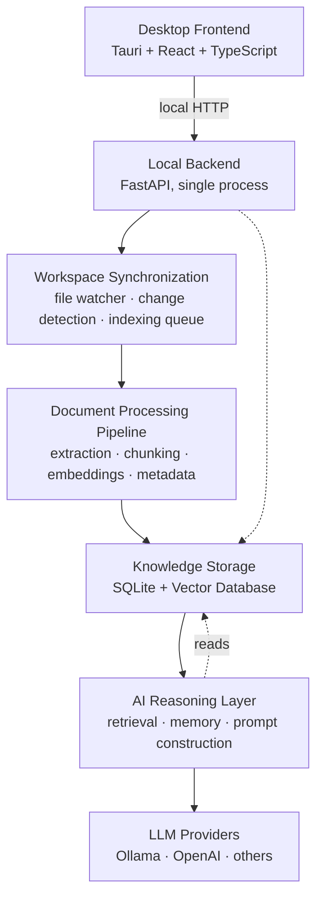

# Rune <p align="center">
  
</p>


**A local-first AI academic companion.**

Rune turns a student's scattered academic material — lecture PDFs, notes, assignments, old exams, projects — into a private, intelligent knowledge system that runs entirely on their own machine.

> Your knowledge stays yours.

[]()
[]()
[]()

<!--  -->
<!-- Demo GIF placeholder: docs/assets/demo-placeholder.gif -->

---

## Why Rune?

Over a degree, a student accumulates thousands of files: lecture slides, scanned notes, past exams, half-finished assignments — spread across folders, semesters, and formats, with no system connecting them to what the student actually understands or struggles with.

Existing tools solve pieces of this, not the problem itself:

- **Note apps** (Obsidian, Notion) organize *what you wrote*, not *what you understand*. They have no idea which concepts you're weak on.
- **General chat assistants** (ChatGPT, Claude) have no persistent, per-course memory of your material or your history with it — every conversation starts from zero.
- **Flashcard tools** (Anki, Quizlet) require you to manually author every card and have no awareness of your syllabus, your lectures, or your actual exam content.

None of these maintain a durable, structured model of a specific student's academic knowledge over time. Rune is built around that gap. It is not a document Q&A chatbot with a knowledge base bolted on — the persistent understanding of the student is the product; RAG-based chat is one interface into it.

Rune is also **local-first by design**, not as a compliance checkbox. Academic material and study behavior are personal; the app is built to work fully offline with local models, so a student's documents and questions don't have to leave their machine.

---

## Features

### Implemented

> **Note:** The repository is in early development. See [`docs/STATUS.md`](./docs/STATUS.md) for what is actually built versus planned.

- **Local workspace intelligence** — point Rune at your academic folders; it indexes them without moving or duplicating your files.
- **Document processing pipeline** — text extraction, chunking, and embedding for PDFs, Word documents, and plain text/Markdown notes.
- **Semantic + metadata-aware search** — retrieval scoped by course, document type, and recency, not just raw similarity.
- **RAG-powered conversations** — ask questions grounded in your own lecture material, notes, and past exams.
- **Persistent memory** — Rune extracts and stores durable facts about your study preferences, recurring struggles, and context across sessions — not full conversation logs.
- **Incremental workspace synchronization** — a file watcher detects created, modified, and deleted files and re-indexes only what changed, not the whole workspace.
- **Course-aware organization** — documents and conversations are scoped to the course they belong to.
- **Local LLM support** — runs against local models via [Ollama](https://ollama.com) by default; no account or API key required to use Rune.
- **Provider-agnostic AI layer** — the LLM and embedding layer is abstracted behind a common interface, so cloud providers can be added without touching the rest of the system.
- **Privacy-first architecture** — all indexing, storage, and inference can run entirely offline, on-device.

### Roadmap

- **Concept mastery tracking** — a per-course model of what a student actually understands, built from real study behavior, not self-reporting.
- **Weakness-weighted practice generation** — auto-generated practice questions drawn from a student's own material, biased toward tracked weak spots.
- **Exam readiness reports** — a synthesized, honest answer to "am I ready for this exam," with targeted review recommendations.
- **Proactive daily focus** — a computed "what's worth studying today" view, rather than a blank chat box.
- **Email intelligence** — detection and extraction of deadlines, announcements, and tasks from university-related email, with human approval required before any action is taken on the student's behalf.
- **Calendar integration** — deadlines and study sessions reflected in the student's calendar.
- **Adaptive tutoring** — chat responses that account for a student's tracked strengths and weaknesses.
- **Structured concept graphs** — an internal, functional representation of how concepts relate, used to drive mastery tracking and practice generation (not a visual note-graph feature).

See [Roadmap](#development-roadmap) for phasing.

---

## Architecture Overview

Rune is a **modular monolith**, not a microservices system. A single backend process runs entirely on the student's machine, organized into clearly bounded modules with a strict internal dependency direction (API → services → AI/data/workspace layers). This gives the same separation of concerns a services-based architecture would, without the deployment, networking, and operational overhead a single-user local application has no use for. Microservices are the right tool for scaling independent teams and independent load profiles across a network — neither applies to software that runs on one student's laptop.



**Why local-first:** academic documents and study behavior are sensitive. Running indexing and inference on-device by default means a student's material never has to leave their machine to get value from the app — cloud models are an opt-in choice per feature, not a requirement.

**Why modular, not microservices:** this is single-user desktop software. The module boundaries (API layer, services, AI layer, workspace sync, data layer) are enforced through code organization and import direction, giving the maintainability and testability benefits of service boundaries without paying for distributed systems complexity that has no payoff here.

---

## How It Works

### First-time setup

1. The student selects a workspace folder (or several) containing their academic files.
2. Rune scans the workspace and collects file metadata (path, type, course association if organized by folder).
3. Documents are processed: text extraction → chunking → embedding generation.
4. Embeddings and metadata are written to the knowledge store (SQLite + vector database).
5. The student can begin asking questions once initial indexing completes; large workspaces index progressively rather than blocking on full completion.

### Daily usage

1. The file watcher detects file creation, modification, or deletion in the workspace.
2. Change detection compares file content hashes against stored state — only genuinely changed files are re-processed, not the whole workspace.
3. When the student asks a question, the AI layer retrieves relevant chunks (and relevant memories) for the current course/context.
4. The assistant responds using the retrieved material as grounding, and durable facts worth remembering are extracted and stored for future sessions.

---

## Installation

### Prerequisites

- **Operating system:** Windows 10+, macOS 12+, or a recent Linux distribution.
- **[Ollama](https://ollama.com)** installed locally, for local model inference (recommended; Rune can also be configured to use a cloud provider instead).
- **Hardware guidance:**
  - Minimum: 8GB RAM, integrated graphics — works with smaller quantized models, slower inference.
  - Recommended: 16GB RAM, a GPU with 4GB+ VRAM — comfortable with mid-sized local models (7-8B parameter class, quantized).
  - No GPU is required — Rune runs on CPU-only inference, just more slowly.

### Installation steps

```bash
# Clone the repository
git clone https://github.com/AdemGhalleb/Rune.git
cd Rune

# (Once packaged releases exist, this section will instead point to
# platform-specific installers — see Releases.)

# One-time setup
./scripts/setup.sh          # macOS/Linux
# scripts/setup.ps1         # Windows (PowerShell)

# Pull a local model (example — needed once AI features land)
ollama pull llama3.2:3b
```

### Configuration

On first run, Rune creates a local configuration file (default location varies by OS) where you can set:

- Which model handles chat vs. lightweight tasks like classification.
- Whether cloud providers are enabled, and which one.
- Workspace folder paths.

### First launch

```bash
# Backend + frontend together
npm run dev:all

# Or separately:
npm run dev:backend    # FastAPI on http://127.0.0.1:18742
npm run dev            # Vite UI on http://localhost:1420

# Tauri desktop shell (requires Rust toolchain)
cd apps/desktop && npm run tauri:dev
```

On first launch, Rune will prompt you to select a workspace folder and begin initial indexing.

---

## User Guide

A student-focused walkthrough — with no assumed technical background — lives in [`USER_GUIDE.md`](./USER_GUIDE.md). It covers first-time setup, organizing a workspace, using the assistant day-to-day, how the memory system works, and how privacy is handled. This README's [How It Works](#how-it-works) section above is the technical summary; the user guide is the practical one.

---

## Developer Documentation

### Project structure

```
rune/
├── apps/
│   ├── desktop/            # Tauri shell + React/TypeScript UI (feature-organized)
│   │   ├── src/            # Frontend source
│   │   └── src-tauri/      # Tauri native shell
│   └── backend/
│       └── app/
│           ├── api/        # Thin FastAPI routers — parse request, call a service, return
│           ├── services/   # Business logic and orchestration
│           ├── ai/         # Providers, RAG pipeline, memory, mastery
│           ├── workspace/  # File watching and change detection
│           ├── workers/    # Background job scheduling and execution
│           ├── db/         # SQLAlchemy models, migrations, vector store integration
│           └── core/       # Config, logging, shared utilities
├── docs/                   # Architecture notes, ADRs, implementation status
├── scripts/                # Local dev tooling (setup, dev, test)
└── .github/                # CI workflows
```

### Major modules

- **`apps/desktop/`** — the Tauri shell and React UI, organized by feature (chat, documents, memory, settings) rather than by file type; communicates with the backend over local HTTP.
- **`backend/app/api/`** — the HTTP boundary; contains no business logic.
- **`backend/app/services/`** — orchestrates the AI layer, database, and workspace modules to fulfill a request; this is where feature logic actually lives.
- **`backend/app/ai/rag/`** — the ingestion pipeline (extraction, chunking, embedding, metadata tagging) and the retrieval logic used at query time.
- **`backend/app/ai/memory/`** — extracts durable, structured facts from interactions rather than storing raw conversation history.
- **`backend/app/ai/providers/`** — the LLM/embedding abstraction; every provider (Ollama, OpenAI, future additions) implements the same interface, and the rest of the codebase depends only on that interface.
- **`backend/app/workspace/`** — file watching, content hashing, and change detection; the mechanism behind incremental indexing.
- **`backend/app/db/`** — SQLAlchemy models (documents, courses, conversations, memories) and a thin wrapper around the vector store, so the vector backend can be swapped without touching the rest of the codebase.

See `docs/architecture.md` for the full design rationale and `docs/adr/` for individual architecture decisions.

---

## Technology Stack

| Layer | Technology |
|---|---|
| Desktop shell | [Tauri](https://tauri.app) |
| Frontend | React, TypeScript |
| Backend | Python, [FastAPI](https://fastapi.tiangolo.com) |
| Local inference | [Ollama](https://ollama.com) |
| AI orchestration | Custom retrieval/prompting pipeline (no heavyweight agent framework at this stage) |
| Relational storage | SQLite |
| Vector storage | Embedded vector database (evaluation in progress between lightweight options and Qdrant) |

Rune is not locked to this stack's specific choices at every layer — the LLM/embedding provider abstraction and the vector store wrapper exist specifically so components can be swapped as the project matures.

---

## Development Roadmap

**MVP**
- Workspace selection, indexing, and incremental synchronization.
- RAG-based chat grounded in the student's own material.
- Persistent, structured memory (not raw conversation logs).
- Local model support via Ollama, with a provider-agnostic AI layer underneath.
- Concept-level mastery tracking and weakness-weighted practice question generation.

**V2**
- Exam readiness reports and a proactive "today's focus" view.
- Email intelligence (deadline/task extraction, with human approval before any action).
- Calendar integration.
- Adaptive tutoring that accounts for tracked strengths and weaknesses.

**Advanced**
- Cross-course pattern detection (recurring weaknesses across subjects, not just within one).
- A general-purpose, tool-using study agent (search material, check mastery state, generate practice, check deadlines) — introduced only once enough underlying tools exist as plain services to make an agent loop meaningfully better than fixed pipelines.
- Structured concept graphs powering deeper reasoning about how topics relate.

This roadmap is deliberately conservative in the early phases: infrastructure and the mastery-tracking core come before automation and agent features, since the latter depend on the former to be useful rather than gimmicky.

---

## Contributing

Rune is early-stage and architecture is still settling — if you're interested in contributing, opening an issue to discuss the change before submitting a large PR is the fastest path to a merged contribution.

- **Branching:** feature branches off `main`, named `feature/<short-description>` or `fix/<short-description>`.
- **Issues:** please include reproduction steps for bugs, and for feature requests, describe the student problem being solved, not just the feature — see the [product philosophy](#why-rune) above for the bar features are held to.
- **Development setup:** see [Installation](#installation) above; `backend/tests/` and standard `pytest`/`npm test` conventions apply once test suites are established.
- **Code style:** Python code follows `black`/`ruff` formatting; TypeScript follows the project's `eslint`/`prettier` config (both to be added to CI as the project matures).

A `CONTRIBUTING.md` with fuller detail will be added as the contributor workflow solidifies.

---

## License

*License to be determined.* A license file will be added before the first public release.

---

<p align="center">Built for students who want their study material to actually work for them.</p>
